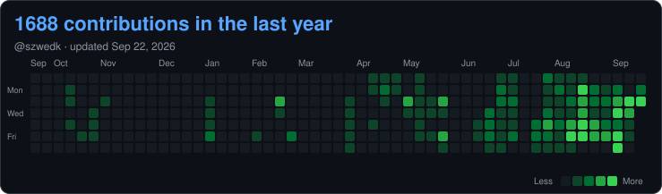

# Kamil Szwed

Head of Technology at [RoboStore](https://robostore.com). I work on humanoid and quadruped
robots — mostly Unitree G1, Go2, and B2 — from SDK-level joint control up through
teleoperation, navigation, and the deployment tooling that keeps them running on a customer
site. Most of what I do sits where firmware, ROS 2, and a web frontend have to agree with
each other.

[kamilszwed.com](https://kamilszwed.com) ·
[LinkedIn](https://www.linkedin.com/in/kamilszwed006) ·
[kamil@robostore.com](mailto:kamil@robostore.com)

<!-- CONTRIB:START -->
<!-- Auto-generated by github-daily-bot; do not hand-edit this block -->

  

---
<!-- CONTRIB:END -->

## Projects

| Project | What it is | Stack |
|:--------|:-----------|:------|
| [**brainco-revo2-hand-control**](https://github.com/szwedk/brainco-revo2-hand-control) | Desktop app for the BrainCo Revo2Touch prosthetic hand: live tactile sensor and force readouts, SVG hand control, pose editing. Talks to the device over USB serial through a Python engine, with a typed JSON WebSocket protocol between engine and UI. Runs fully against a simulator when no hardware is attached. | Tauri (Rust) · React · TypeScript · Python |
| [**g1-tele**](https://github.com/szwedk/g1-tele) | Upper-body teleoperation for the Unitree G1. MediaPipe pose estimation from a webcam is mapped to arm joint commands over the Unitree SDK, with a simulation overlay for testing without a robot. | Python · MediaPipe · Unitree SDK · ROS 2 |
| [**RS-G1-SDK**](https://github.com/szwedk/RS-G1-SDK) | Web-based SDK guide for the Unitree G1 — modular tutorial sections and API walkthroughs for developer onboarding. Unofficial; not affiliated with Unitree or RoboStore. | Next.js (App Router) · TypeScript |
| [**szwedk.github.io**](https://github.com/szwedk/szwedk.github.io) | Source for [kamilszwed.com](https://kamilszwed.com). No framework, no build step, no CDNs — vendored GSAP/Lenis, self-hosted fonts, and an audit pass for broken links, console errors, and accessibility. | HTML · CSS · JS · GitHub Pages |
| [**intellipark_VSCODE**](https://github.com/szwedk/intellipark_VSCODE) | IntelliPARK — campus smart-parking platform: real-time space monitoring, license plate recognition, congestion prediction, and an admin dashboard. Camera and IoT nodes feed a web app. | Next.js · Firebase · Arduino |
| [**inspire_hands**](https://github.com/szwedk/inspire_hands) | Fork of [Sentdex/inspire_hands](https://github.com/Sentdex/inspire_hands) with Modbus control for Inspire RH56 hands, used for dexterous manipulation work on the G1. | Python · Modbus |
| [**smartknob**](https://github.com/szwedk/smartknob) | Fork of [scottbez1/smartknob](https://github.com/scottbez1/smartknob) — haptic input knob with software-defined endstops and virtual detents. Build notes and firmware tweaks for my own unit. | ESP32 · PlatformIO · C++ |

## Interactive demos

Built for [kamilszwed.com](https://kamilszwed.com) — each one runs in the browser, no install.

| Demo | What it does |
|:-----|:-------------|
| **Push the Humanoid** | Shove a line-drawn Unitree G1 and watch it recover: ankle strategy, hip strategy, then a capture-point step. Link lengths and joint limits come from the real URDF |
| **Gait Lab** | Quadruped gait explorer with live footfall diagrams, built on the Go2 URDF |
| **IntelliPARK Sandbox** | The campus smart-parking platform, condensed into a live simulation with droppable camera nodes |
| **The Contact Sheet** | A 35mm contact sheet with a hover loupe and a grease pencil for marking keepers |
| **Wordmark Reprint** | Press and hold to reprint the name slicer-style: isolines, infill, layer by layer |
| **The Brief** | Five questions that compose a structured project brief into an email |

There is also a quadruped living somewhere on the home page. Type `go2` and it will come out.

## What I work on

- **Humanoid deployment** — G1 commissioning and integration: SDK2, ROS 2, whole-body control,
  Inspire Hands and BrainCo end effectors.
- **Teleoperation** — VR whole-body control over WebRTC, targeting Pico, Quest, and Apple
  Vision Pro, bridged to G1 motor commands.
- **Autonomous patrol** — Go2 and B2 for security work: Nav2, SLAM, LiDAR mapping, and object
  detection running on-robot.
- **Edge inference** — Vision and perception pipelines on Jetson Orin, deployed as containers
  alongside the ROS 2 stack.
- **Fleet infrastructure** — Dockerized ROS 2 images, CycloneDDS tuning for multi-robot
  networks, MQTT telemetry, AWS sync, and OTA updates.
- **Field hardware** — ESP32 peripheral firmware, 3D printed mounts and accessories, sensor
  integration and calibration, 5G connectivity over RUTM50 for sites without usable Wi-Fi.

## Hardware

| Platform | Type | What I use it for |
|:---------|:-----|:------------------|
| **Unitree G1** | Humanoid | SDK2 and ROS 2 control, whole-body teleop, hand integration, customer commissioning |
| **Unitree Go2** | Quadruped | Nav2 and SLAM, LiDAR mapping, autonomous patrol routes |
| **Unitree B2** | Industrial quadruped | Payload integration and security deployments |
| **Inspire RH56** | Dexterous hands | Modbus control, force sensing, manipulation on the G1 |
| **BrainCo Revo2** | Prosthetic / robotic hand | Tactile sensing, pose control, desktop tooling |
| **Jetson Orin** | Edge compute | On-robot inference and containerized ROS 2 nodes |
| **LattePanda** | x86 SBC | Lightweight robot compute where Jetson is overkill |
| **RUTM50** | Industrial 5G router | Low-latency site connectivity and mesh networking |

## Stack

- **Robotics** — ROS 2 (Humble / Iron), CycloneDDS, Nav2, `ros2_control`, Unitree SDK2, SLAM, LiDAR
- **Languages** — Python, C++, TypeScript, Bash
- **Simulation** — Isaac Sim, Isaac Lab, MuJoCo
- **Teleop & VR** — WebRTC, Unity, Pico, Quest, Apple Vision Pro
- **Infrastructure** — Docker, AWS, MQTT, GitHub Actions, Ubuntu 22.04
- **Vision** — OpenCV, on-device inference on Jetson

---

Happy to talk about humanoid deployment, teleoperation, or embodied AI —
[kamil@robostore.com](mailto:kamil@robostore.com).
